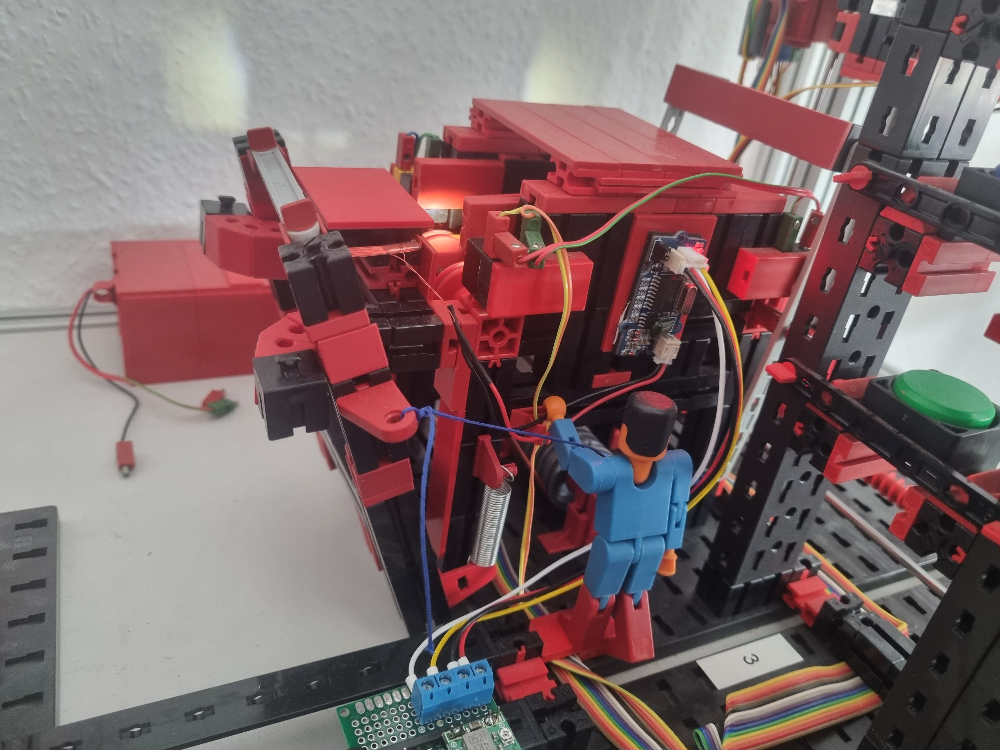

# High-Bay Storage

# Modifications

I wanted each of my models to generally work completely independent of any other part of the factory. 
Each of the models sort of being `automation-microservices`. 

In order to do that, I needed to be able to identify the token before I ingest it.

It would have been nice to do the detection inside the ingestion tunnel, however for this we needed to get a storage container first.
I was thinking of storing empty containers on top of the ingestion tunnel and simply getting one whenever a token is coming in.
This however would have extended the API of the storage microservice.

In order to solve this problem, I added `RFID` stickers to the bottom of every token in the factory. 
This `RFID` contains the ID of the token, which I encoded the storage position into.
Then I constructed an `RFID-reader` underneath a new platform in front of the ingestion side of the tunnel.
The robot arm places the token here and the `RFID-reader` sends a message to the PLC which tells it which storage container to fetch.

Now we needed a way to move the token from the detector into the container.
I guess if I had two more digital outputs available, I would have added a compressor and a valve to the model, which uses a cylinder to move to token into the bin.
However, as I didn't have these inputs, and I knew from the encoders how hard it is to currently get such hardware, I decided to construct a mechanism, where the robot arm in the storage, operates a lever, that pushes the token into the crate. 

I might be updating this as soon as getting hardware becomes simpler.

For the RFID Reader, I used a `GRV RFID 125 Arduino - Grove 125 KHz RFID Reader, uem4100` (https://www.reichelt.de/arduino-grove-125-khz-rfid-reader-uem4100-grv-rfid-125-p191238.html)

The specs say the output format is `UART` and I was able to decode the signal with my `Saleae Logic Pro 16` logic analyzer, but when connecting it to the PLC, I only got garbage. 
Turns out the signal is not an RS-232 or RS-485 signal, but a TTL signal. So I had to add a TTL-to-RS232 adapter to convert the signal.
With this new signal the PLC was able to understand the messages sent from the RFID reader.

In above image, you can see the TTL converter as the little chip on the bottom. 
The circuit board on the top is a voltage regulator, that converts the 24V of the factory down to the 5V the RFID-reader requires.

# Hardware

The PLC I selected for this model is a `Wago PFC200 (750-9212)`. 
This is extended by the following IO modules:
- `750-430`: 8-channel digital inputs
- `750-530`: 8-channel digital outputs
- two `750-637/000-002`: Optical encoder modules
- `750-600`: Terminator module

Here I should mention that initially I purchased:
- `750-403`: 4-channel fast digital input
- `750-459`: 4-channel analog input

The analog input, was simply because Fischertechnik advertised the need of an analog input in the specs.
This seems to have been related to a rudimentary bar-code-scanner, that initially was located in the ingestion tunnel of the factory.
This scanner needed an analog input. 
However, it turns out that the latest versions of the factory are shipped without this.

The 4-channel fast digital input, I purchased instead of the two optical encoders as only the fast digital inputs were able to process the extremely fast signals coming from the optical encoders.
Unfortunately it turned out the internal cycle time the PLC was able to provide, was too slow to correctly process these signals.
I could imagine, that more performant versions of Wago PLCs might be able to do this, but my PFC200 simply wasn't fast enough.

So I tried purchasing the optical encoder modules (one for each of the axis of the model).
Unfortunately Wago wasn't able to deliver, due to current shortages in their supply chain.
I therefore purchased all available modules I could find on Ebay (world-wide) (It sounds a lot cooler this way, in the end it was just the two modules I needed the world had to offer ;-) ).
These modules handle the decoding and counting internally, and you simply can read the current postion from the module.

## I/O Connections

Here's how I connected all inputs and outputs to the PLC

### Inputs

### Outputs

# Configuration of the PLC

## I/O Configuration

# Writing the PLC Programm

## Positions

The following values are positions in the Fischertechnik factory.

| Axis           |  vert |   hor |
|----------------|------:|------:|
