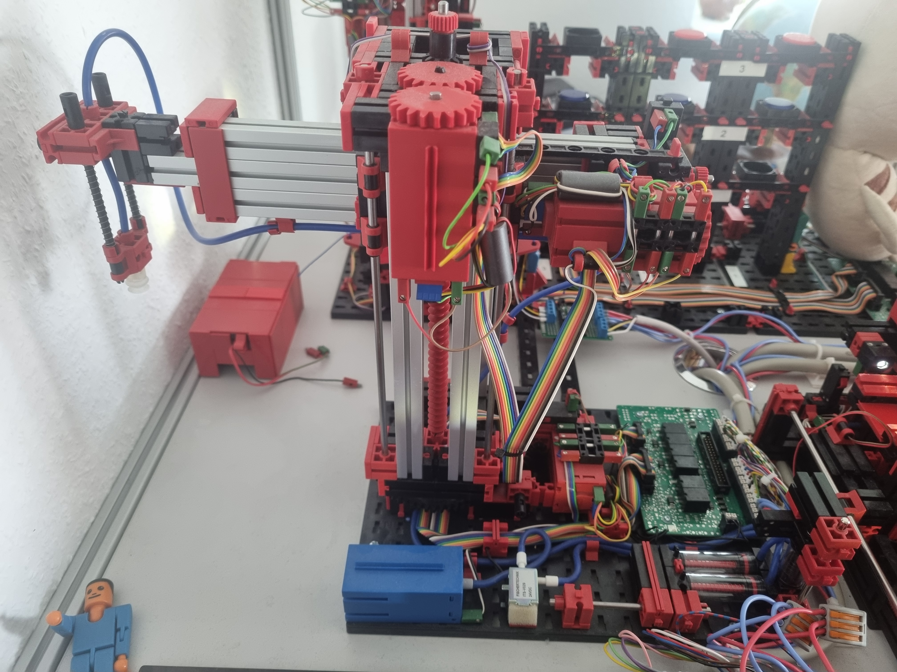
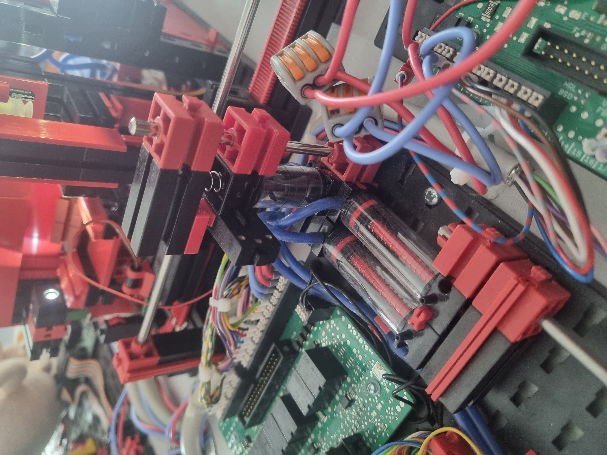
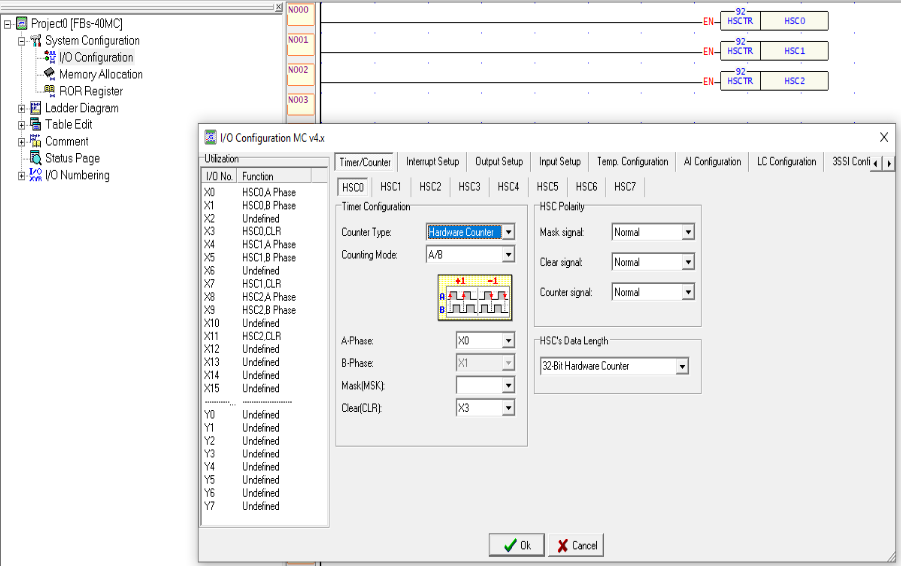
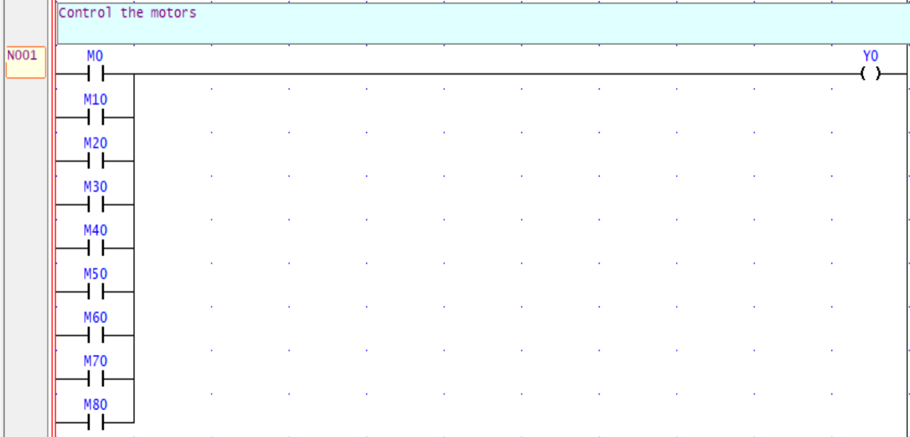
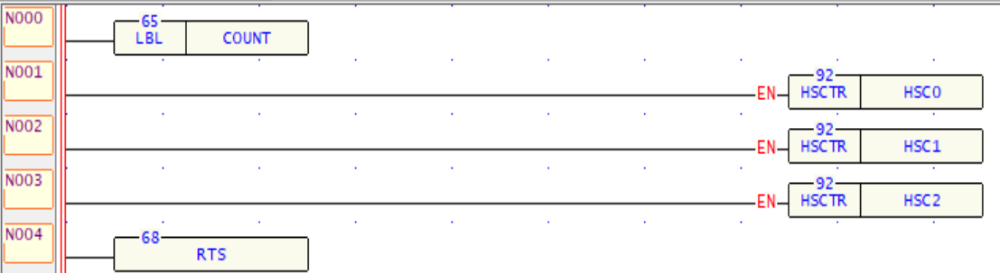
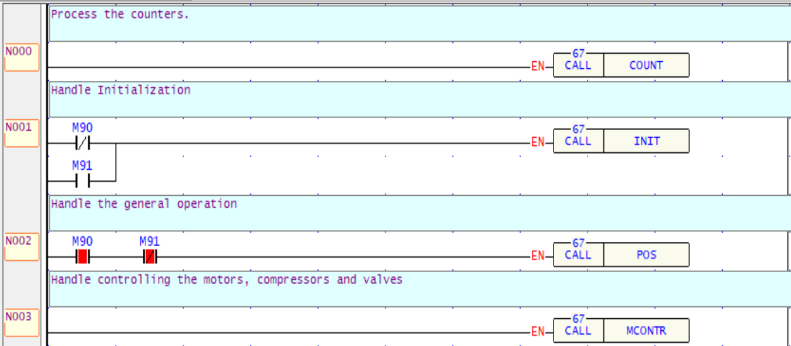
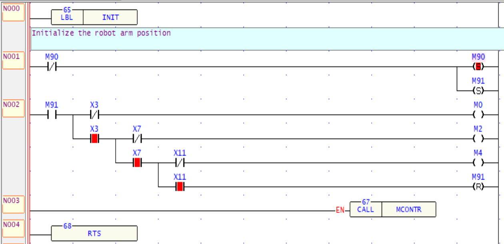

# Robot arm

The robot arm is probably the most essential part of the Fischertechnik factory.
It's the part that moves Tokens around from one part of the factory to another.

In order to move tokens, it uses a vacuum sucker to grab and move a token.

# Modifications

As the robot arm uses a vacuum sucker to move tokens, it can happen, that the robot misses a token or looses it in transit.
The original model isn't able to detect such situations. 

In order to add this feature, I used a standard cylinder, a standard switch and a spring feather to construct something of detecting the presence of a vacuum.

The cylinder is simply added to the connection to the sucker via t-junction and as soon as there's under-pressure, is pulls back the cylinder, which presses the switch.
As soon as the vacuum is lost, the spring feather pushes the cylinder back up and the switch is no longer pressed.

With this cheap little trick I can reliably detect if the token is still "hanging on" to the robot arm.

# Hardware

For automating the robot arm modell I've been using a `Fatek FBs-40MC` PLC.
In order to communicate with the device, I also added a `FBs-CM55E` which adds two RS-485/RS-232 ports.
One of them (Port 4) seems to also be able to be accessible via Ethernet connection.

However instead of having 3 ports, I think the FBs-CM55E is much more two RS ports and one Ethernet-to-Serial Adapter connected to Port 4.
As soon as I configured the Port 4 for serial, I was no longer able to communicate via Ethernet.

I am therefore programming the PLC via a serial cable connected to the on-board serial port (the one with the PS2-like connector).

## I/O Connections

Here's how I connected all inputs and outputs to the PLC

### Inputs

(The connections X0 to X11 are important that they are exactly as mentioned here. See why, in the configuration part)

X0: Signal A of the optical encoder for vertical axis (Raise/lower the Arm)
X1: Signal B of the optical encoder for vertical axis (Raise/lower the Arm)
X3: Reference switch vertical axis
X4: Signal A of the optical encoder for horizontal axis (Extend/retract the arm)
X5: Signal B of the optical encoder for horizontal axis (Extend/retract the arm)
X7: Reference switch horizontal axis
X8: Signal A of the optical encoder for rotational axis (Turn the Arm clockwise/anticlockwise)
X9: Signal B of the optical encoder for rotational axis (Turn the Arm clockwise/anticlockwise)
X11: Reference switch rotational axis
X12: Vacuum detection

### Outputs

Y0: Motor vertical up
Y1: Motor vertical down
Y2: Motor horizontal retract
Y3: Motor horizontal extend
Y4: Motor rotate clockwise
Y5: Motor rotate counterclockwise
Y6: Compressor
Y7: Valve vacuum

# Configuration of the PLC

Luckily `Fatek` has a "slightly" different attitude as most automation vendors. 
If you paid for a Fatek PLC you get the automation Software for free. 
It's called `WinProLadder` and can be downloaded from here: https://www.fatek.com/en/download.php?act=list&cid=141 after creating a free account. 
If you download it, it's currently something around 3.1MB in size (MB ... not GB as some other vendors).

Not quite sure, if it's a downside, however the software is anything but fancy. 
But it does the job.

I was actually able to use it quite intuitively, which I think is quite impressive in the automation sector.
The only real downside, I would say, is that you can only programm it using `ladder-logic`. 
This is less programming for me, but more a puzzle game, of how you can trick the system to do what I want.

But if you ask me if I would rather live with that, instead of paying 4k€ for a TIA portal ... any time.

## I/O Configuration

The robot arm uses 3 optical encoders. 
In order to process the signals, we need to use the built-in support for fast counters.

My FBs-40MC has 4 hardware counters included, however the inputs need to be connected accordingly.
Each of them stores the current position in a pre-defined register.
These are also readable via modbus.

These are configured in the `System Configuration` / `I/O Configuration` tab, on the `Timer/Counter` tab. 
I configured them by selecting the sub-tabs: `HSC0`, `HSC1` and `HSC2` and setting them the following way.

### MSC0 (Up/Down)

Counting Mode set to: `A/B`
A-Phase set to: `X0`
B-Phase set to: `X1`
Mask(MSK) left unassigned
Clear(CLR) set to: `X3`

The output register: `R4096`
PLC4X-compatible Modbus address: `404096`

So the encoder signals are connected to the inputs X0 and X1, while the signal of the home-switch is connected to X3.

### MSC1 (Retract/Extend)

Counting Mode set to: A/B
A-Phase set to: X4
B-Phase set to: X5
Mask(MSK) left unassigned
Clear(CLR) set to: X7

The output register: `R4100`
PLC4X-compatible Modbus address: `404100`

### MSC2 (Rotate clockwise/counterclockwise)

Counting Mode set to: A/B
A-Phase set to: X8
B-Phase set to: X9
Mask(MSK) left unassigned
Clear(CLR) set to: X11

The output register: `R4104`
PLC4X-compatible Modbus address: `404104`

### Enable the Hardware counters

After configuring the counters, we still need to provide computing-power to them. 
This is done by adding 3 function blocks `92.HSCRT` to the ladder diagram and simply connecting them. 
Each of the function blocks will reference one counter: `HSC0`, `HSC1` and `HSC2`.

# Writing the PLC Programm

## General notes on controlling the motors

As we'll have multiple ladder rows setting and resetting the inputs of the motors, directly setting them doesn't work.
Therefore, I'm using multiple markers to decide if a motor should be enabled or disabled.

## Markers

The 9x range is reserved for controlling things that aren't explicitly related to output.

M90: The initialization has been triggered
M91: The initialization is in progress

To simplify reading and understanding the ladder program the markers `M00` to `M79` control the outputs. 
The last digit of the marker directly maps to the output number. So `M34` controls output `Y4`. 

M{x}0: Raise the arm
M{x}1: Lower the arm
M{x}2: Retract the arm
M{x}3: Extend the arm
M{x}4: Rotate the arm clockwise
M{x}5: Rotate the arm counterclockwise
M{x}6: Turn on the compressor
M{x}7: Open the valve

## Sub Programms

Ladder programs can become quite messy, I therefore split it up into multiple `Sub Programs`. 
Each Sub Program taking care of one individual aspect of the program. 

In WinProLadder, in order to create a Sub-Program, you need to first create a file in the Project tree.

Then in the ladder editor you need to define a `Label` by using the function block `65.LBL` and giving the label a name.
The last line in the editor needs to be a call to the function block `68.RTS` which is the return-statement.

When calling the Sub Programm, you use the function block `67.CALL` and reference the label you created.

In this ladder program you can also see, how the initialisation sub programm is only executed if the robot is not yet initialized or while it's still initializing and the positioning logic is only executed after initialisation is finished.

## Initializing

Whenever the PLC is started, we need to ensure the arm is initialized, by moving it to the home position.

## Positions

The following values are positions in the Fischertechnik factory.

| Axis           |  vert |   hor |   rot |
|----------------|------:|------:|------:|
| Register       | R4096 | R4100 | R4104 |
| Blue Bay       |   760 |   420 |   285 |
| Red Bay        |   760 |   270 |   355 |
| Green Bay      |   760 |   240 |   438 |
| Oven Intake    |   420 |   840 |   880 |
| Hig-Bay Ingest |    40 |    20 |  1324 |
| Hig-Bay Output |   120 |   220 |  1324 |
